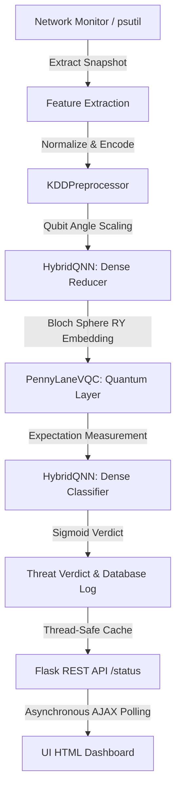

# NetSentinel

NetSentinel is an advanced network security and intrusion detection platform that combines classical network scanning and interface monitoring with an integrated, state-of-the-art Hybrid Classical-Quantum Neural Network (QNN) threat-detection pipeline. Designed for security operators and network engineers, NetSentinel provides real-time traffic analysis, vulnerability profiling, and machine-learning-backed anomaly classification.

---

## 1. Overview
Modern intrusion detection systems struggle with high-dimensional feature spaces and scaling latency. NetSentinel addresses these limitations by introducing a hybrid machine learning pipeline. High-dimensional classical network metrics are compressed using deep neural network layers, embedded as rotation angles on a simulated quantum Bloch sphere, processed via a parameterized Variational Quantum Circuit (VQC), and mapped to binary threat decisions. 

The application runs as a multi-threaded Flask console with SQLite/PostgreSQL storage, background scheduling daemons, and an interactive modern dashboard.

---

## 2. Key Features
- **Multithreaded Port Scanner**: High-speed TCP port scanner with customizable thread pools, connection timeouts, and service-banner identification.
- **Scan Comparison & Intelligence**: Historical analysis tools to diff scan sessions, track delta changes in port status, and generate recommendation reports.
- **Asynchronous Live Network Monitor**: Real-time psutil interface collector monitoring active packet transfers and upload/download speeds.
- **Hybrid QNN Threat Classifier**: Quantum-classical pipeline built with PyTorch and PennyLane to detect anomalous network payloads.
- **Robust Preprocessing Pipeline**: Custom NSL-KDD dataset preprocessor supporting continuous metric imputation, MinMax scaling, and categorical one-hot encoding.
- **Asynchronous Telemetry Evaluation**: Background execution loops that periodically scan system interfaces and run predictions under a thread-safe cached status API.
- **Comprehensive Visual Analytics**: Interactive UI dashboards featuring real-time telemetry counters, Chart.js training metrics curves, and manual vector classifiers.
- **Exporting & Reporting**: Single-click PDF summary exports and raw CSV data tables for scan sessions.

---

## 3. System Architecture
NetSentinel's threat pipeline flows cleanly from raw telemetry to user dashboards:



- **Classical Reducer**: Compresses the 122 preprocessed NSL-KDD input features down to the target qubit count (e.g., 4) using linear layers, mapping values to $[-1, 1]$ via `Tanh`.
- **Quantum Ansatz Layer**: Scales features to $[-\pi, \pi]$ for AngleEmbedding and runs StronglyEntanglingLayers on a default qubit simulator device, outputting PauliZ expectation measurements.
- **Classifier Output**: Decodes expectations via a single-neuron linear classifier with `Sigmoid` probability outputs in $[0.0, 1.0]$.

---

## 4. Technology Stack
- **Web Backend**: Flask 3.1, Werkzeug (Local WSGI Server)
- **Database ORM**: SQLAlchemy 2.0, Flask-SQLAlchemy 3.1
- **Machine Learning**: PyTorch 2.4, Scikit-Learn 1.5
- **Quantum Computing Simulation**: PennyLane 0.37
- **UI Frontend**: HTML5, Vanilla CSS, Bootstrap 5.3, Bootstrap Icons 1.11, Chart.js 4.4
- **System Telemetry**: Psutil 6.0
- **Testing Suite**: Pytest 8.4

---

## 5. Project Structure
```text
NetSentinel/
├── app/                      # Flask Application Package
│   ├── analytics/            # Analytics Services and Chart Formatters
│   ├── routes/               # Blueprint Controllers
│   │   ├── api.py            # Classical REST API Endpoints
│   │   ├── main.py           # Core System Routes
│   │   ├── ui.py             # User Interface Page Renderers
│   │   └── qnn.py            # QNN Blueprint & Asynchronous Monitor Thread
│   ├── services/             # Core Scanner & Network Monitoring Services
│   ├── templates/            # Jinja2 HTML Layout Templates
│   ├── models.py             # SQLAlchemy Database Schema Models
│   └── extensions.py         # DB Extensions Mapping
├── qnn/                      # Quantum Threat Classification Pipeline
│   ├── circuits.py           # PennyLane Variational Quantum Circuits (VQC)
│   ├── model.py              # Hybrid Classical-Quantum Model Architecture
│   ├── train.py              # PyTorch Training Loop & Mock Generators
│   ├── predict.py            # Inference Wrappers and Feature Mapping Helpers
│   ├── preprocessing.py      # NSL-KDD Feature Scaling and Imputation
│   ├── dataset.py            # DataLoader Pipelines
│   └── utils.py              # Diagnostic Utilities
├── tests/                    # Automated Test Package (61 Unit/Integration Tests)
├── instance/                 # Local SQLite Databases, Checkpoints, and Metrics
├── requirements.txt          # Python Dependency Declarations
├── run.py                    # Application Entry Point
└── .env.example              # Sample Environment Template
```

---

## 6. Installation

Ensure you have Python **3.11** or **3.13** installed on your system.

1. **Clone the Repository**:
   ```bash
   git clone git@github.com:Akashv4554/NetSentinel.git
   cd NetSentinel
   ```

2. **Set up Virtual Environment**:
   - On Windows (CMD/PowerShell):
     ```bash
     python -m venv .venv
     .\.venv\Scripts\activate
     ```
   - On Linux/macOS:
     ```bash
     python3 -m venv .venv
     source .venv/bin/activate
     ```

3. **Install Dependencies**:
   ```bash
   pip install --upgrade pip
   pip install -r requirements.txt
   ```

---

## 7. Environment Configuration
Copy the `.env.example` template to `.env` in the root folder:
- **On Windows**:
  ```cmd
  copy .env.example .env
  ```
- **On Linux/macOS**:
  ```bash
  cp .env.example .env
  ```

Update variables as needed (see the **Environment Variables** section below).

---

## 8. Database Setup
SQLite is configured as the default database for local environments. Table migrations are handled automatically on start:
```python
# app/__init__.py
db.create_all()  # Automatically initializes netsentinel.db tables on boot
```
If connecting to PostgreSQL, update your database connection URI in the `.env` file.

---

## 9. Running the Application
Launch the Flask development server:
```bash
python run.py
```
Open your browser and navigate to `http://127.0.0.1:5000`.

To stop the web server, press `Ctrl + C` in the console.

---

## 10. Port Scanner
Provides high-speed TCP socket sweeps. Users configure target host IPs, port boundaries (Start/End), and thread pool sizes to execute concurrent lookups. Scan results are saved to the database and can be exported as PDF files.

---

## 11. Network Monitoring
Fetches network socket metrics dynamically from `psutil.net_if_stats()` and `psutil.net_io_counters()`. The service calculates current packet queues and upload/download bandwidth speeds.

---

## 12. QNN Threat Detection
Compiles network telemetry arrays to verify system safety:
1. **Extraction**: Collects active connection counters (Duration, Bytes Sent, Bytes Received, Packets Sent, Packets Received).
2. **Preprocessing**: Normalizes numerical scales and categorical labels into a 122-feature tensor using `KDDPreprocessor`.
3. **Quantum Forward Pass**: Reduced values are loaded into the simulated Variational Quantum Circuit on a `default.qubit` simulator backend.
4. **Classification**: Sigmoid activation outputs threat probability and alerts operations if anomalies exceed 50%.

---

## 13. Dataset Preparation
Supports uploading custom datasets inside the AI Threat Detection panel. Datasets must be formatted as CSV representations of the NSL-KDD structure. Custom uploaded files are stored at `instance/uploaded_kdd.csv` and are preferred during subsequent training runs.

---

## 14. Model Training
Triggers an asynchronous training runner using the `Adam` optimizer, `BCELoss` criteria, early stopping, and `ReduceLROnPlateau` learning rate scheduler. If no custom CSV dataset has been uploaded, the pipeline automatically compiles a mock fallback dataset to allow testing training actions out-of-the-box.

---

## 15. Prediction
Supports inference on single-connection dictionaries or batch lists of lists. Runs under PyTorch `inference_mode` for maximum performance, returning predictions containing attack classifications, anomaly probabilities, and model confidence scores.

---

## 16. REST API

The QNN routes are registered under the `/api/qnn` prefix:

### 1. GET `/api/qnn/status`
Returns the thread-safe cached classification state of the live system instantly.
- **Response `200 OK`**:
  ```json
  {
    "anomaly_score": 0.0215,
    "model_trained": true,
    "prediction": "Normal",
    "prediction_badge_color": "success",
    "trained_status": "Trained"
  }
  ```

### 2. POST `/api/qnn/train`
Starts background model training.
- **Request Body**:
  ```json
  {
    "epochs": 10,
    "qubits": 4,
    "layers": 2
  }
  ```
- **Response `202 Accepted`**:
  ```json
  {
    "status": "success",
    "message": "Training started in background."
  }
  ```

### 3. GET `/api/qnn/train-status`
Polls active background training progress.
- **Response `200 OK`**:
  ```json
  {
    "status": "training",
    "epoch": 3,
    "total_epochs": 10,
    "loss": 0.4125,
    "val_loss": 0.3852
  }
  ```

### 4. POST `/api/qnn/upload`
Uploads custom CSV training datasets.
- **Request**: `multipart/form-data` with `"file"` attachment.
- **Response `200 OK`**:
  ```json
  {
    "status": "success",
    "message": "Dataset uploaded successfully."
  }
  ```

### 5. POST `/api/qnn/predict`
Runs inference on raw connection features.
- **Request Body (5 Vital Fields)**:
  ```json
  {
    "duration": 0.0,
    "src_bytes": 10500,
    "dst_bytes": 2200,
    "count": 10,
    "srv_count": 8
  }
  ```
- **Response `200 OK`**:
  ```json
  {
    "status": "success",
    "prediction": {
      "attack_type": "Normal",
      "probability": 0.0841,
      "confidence": 0.9159,
      "prediction_label": "Normal"
    }
  }
  ```

### 6. GET `/api/qnn/history`
Returns lists of metrics over the epochs of the most recent training run.
- **Response `200 OK`**:
  ```json
  {
    "train_loss": [0.654, 0.412],
    "train_acc": [0.55, 0.81],
    "val_loss": [0.582, 0.395],
    "val_acc": [0.60, 0.83],
    "val_precision": [0.62, 0.84],
    "val_recall": [0.58, 0.80],
    "val_f1": [0.60, 0.82],
    "val_auc": [0.64, 0.85],
    "confusion_matrix": [[120, 10], [15, 95]]
  }
  ```

### 7. GET `/api/qnn/model`
Downloads the trained model weights checkpoint `qnn_model.pth`.

### 8. GET `/api/qnn/metrics`
Extracts final epoch performance metrics.
- **Response `200 OK`**:
  ```json
  {
    "status": "success",
    "metrics": {
      "accuracy": 0.834,
      "precision": 0.842,
      "recall": 0.801,
      "f1_score": 0.821,
      "roc_auc": 0.853,
      "confusion_matrix": [[120, 10], [15, 95]]
    }
  }
  ```

---

## 17. Dashboard
The user console features:
- **Port Scanner Panel**: Displays active targets and vulnerabilities.
- **AI Threat Detection Panel**: Includes upload buttons, qubits and layers selections, Chart.js metrics graphs, manual verification classification forms, and prediction log histories.
- **System Anomaly Badge**: A live card that polls `/status` every 3 seconds to display the running system threat state.

---

## 18. Testing
A comprehensive test suite of 61 unit and integration tests covers the scanner engines, telemetry collectors, QNN classifiers, and routes.

Run the test suite inside your virtual environment:
```bash
.venv\Scripts\python.exe -m pytest
```
*Expected output:*
`61 passed in ~35s`

---

## 19. Security Considerations
- **Environment Exclusions**: Ensure that `.env` files are never committed to public version control.
- **Path Sanitization**: Upload file handlers strictly validate file extensions (`.csv`) to prevent directory traversal or remote code execution.
- **Windows Smart App Control**: Unsigned third-party binary DLLs in virtual environments might be blocked on Windows. Add your project root directory to Windows Defender exceptions, or run in a container environment to bypass SAC checks.

---

## 20. Limitations
- **Quantum Hardware Simulation**: Quantum layers are executed on simulated qubit engines (`default.qubit`). Real quantum computers are not utilized.
- **Qubit Dimensions**: Supported qubit sizes are constrained to `(2, 4, 6, 8)` to maintain low simulator execution latency.

---

## 21. Future Roadmap
- Integration of real quantum backend providers (e.g., IBM Qiskit Runtime).
- Automated network quarantine responses when the QNN monitor signals alerts.
- Extended multi-class classification mappings targeting specific Trojan and DDoS families.

---

## 22. Screenshots
*(Attach layout screenshots showing the Port Scanner and AI Threat Detection consoles here)*

---

## 23. Contributing
For details on coding guidelines and PR verification rules, please refer to [CONTRIBUTING.md](CONTRIBUTING.md).

---

## 24. License
This project is licensed under the MIT License - see the `LICENSE` file for details.
